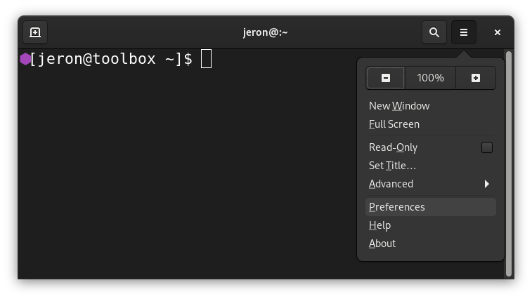

# ⚠ Hamburger-Menu
**Archaic**: Use [page-bar](pagebar.md) instead for modern GUIs.

> Hamburger-menu example screenshot from the GNOME Terminal application.

A hamburger menu, sidebar menu, or basement is a [drawer](drawer.md) or menu
that is opened by pressing a button; The items of the menu are usually buttons
to open different activities, but may also include actions.

## Criticism
Hamburger menus are inefficient for the user to use and make it hard to discover
app functionality (1).

# Links
 1. https://lmjabreu.com/post/why-and-how-to-avoid-hamburger-menus/
