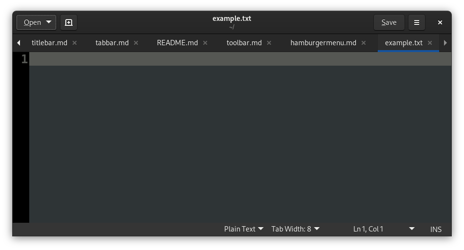
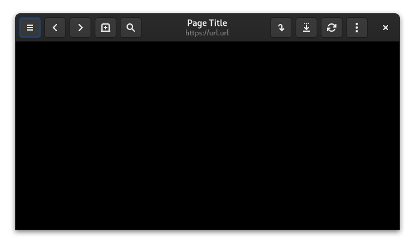

# Header-Bar

> Header-bar Example Screenshot from GNOME, with the GEdit application.

A header-bar is a widget that appears at the top of a window, that allows you
to drag the window around the screen (unless it's on a smartphone).  The
header-bar usually contains the title of the window in the center (or left on a
smartphone), and may also contain a subtitle.  The button widget elements of an
[tool-bar](toolbar.md) may be placed throughout the header-bar, making the
header-bar a combination of [tool-bar](toolbar.md) and [title-bar](titlebar.md).

A standard header-bar has four sections:
 - Navigation Buttons - These are buttons on the left side of the window for
   "navigating" the user's tabs.
 - Title and Subtitle - These are displayed in the middle of the window.
 - Action Buttons - These are buttons displayed on the right side of the window
   as quick actions for the user.
 - Window Buttons - These are buttons for interacting with the window; For a
   simpler, cleaner interface, only show the close button (minimize, maximize or
   fullscreen may also be shown depending on the desktop environment).

## Criticism
Header-bars such as the one used by firefox, and nautilus do not provide enough
space for dragging the window around.  The small areas on the left and right
sides of the window are unintuitive places to drag from.  For this reason, it's
important to leave a large area in the center of the header-bar for dragging
(where the title should be displayed anyway - for consistency), and to put all
widgets on the left and right sides of the headerbar.  This means that
header-bars are a bad place to put a [tab-bar](tabbar.md), and if you choose to
use a [tab-bar](tabbar.md) it should appear beneath the header-bar.

### Example Header-Bar

> Header-bar Example Screenshot from theoretical web browser.

Note how there are no widgets in the center, leaving plenty of space for the
user to drag the window.  The leftmost hamburger button toggles the visibility
of a [tab-tree](tabtree.md).  The next two buttons are the standard back and
forward buttons of a web browser, followed by new tab, and search.  The search
button when clicked would temporarily open an editable text field over the title
when the user is searching for a website; and when the user presses enter,
escape or the search button again the title returns, making the window draggable
again.  On the right side of the header-bar the action buttons are "find/goto",
"save (bookmark)", and "refresh/reload".  The final action button is for
openning a [quick-menu](quickmenu.md), and finally the close window button.
