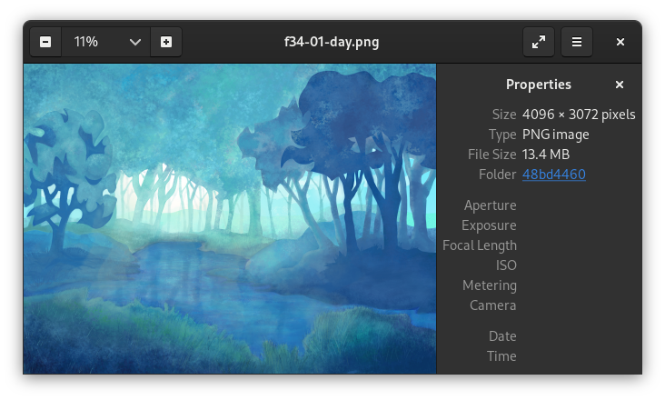

# Info-Pane

> Info-pane example screenshot from the Eye of GNOME application.

An info-pane or side-pane is a widget that displays information/properties of a
file or object.  It is usually located on the right side of the screen.  An
info-pane may or may not allow editing of these properties.  Info-panes are
generally useful for complicated tasks such as vector graphics creation and 3D
modeling, where there are lots of variables the user might want to tweak.  In
some cases, the info-pane can replace [tool-bars](toolbar.md),
[menu-bars](menubar.md), [pop-ups](popup.md) and even
[hamburger-menus](hamburger-menu.md)!

For smartphone GUIs, there is not enough horizontal space for an info-pane, so
they should be implemented as a separate [page](page.md) or [drawer](drawer.md)
that lists each property, and when selected, previews the [scene](scene.md)
while the user tweaks the property.
