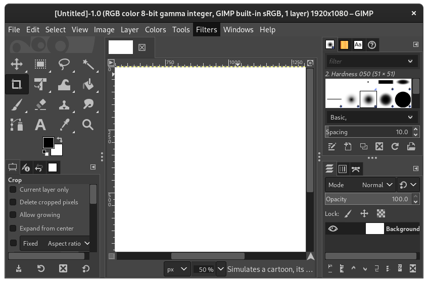

# ⚠ Menu-Bar
**Archaic**: Use [header-bar](headerbar.md), [page-bar](pagebar.md) and
[quick-menu](quickmenu.md), instead for modern GUIs.

> Menu-bar example screenshot from the GIMP application.

A menu-bar is a horizontal list on menu items, that when clicked give a
drop-down of different options.  On MacOS, the menu-bar is placed on the top of
the screen.  On Windows and Linux, the menu-bar is contained within the window.

## Criticism
The menu-bar makes it difficult to find what you're looking for, because of
arbitrary sorting.  For instance, would you find GIMP's remove transparency
options under color, tools, image, file or layer?  It's found under layer, but
it could be expected under any of the others.

Nested menu-bars are complicated to navigate, and make it even harder to find
what you're looking for.

Often aiming with a mouse to select an option from a menu-bar is difficult due
to small font sizes.  Sometimes the way they are implemented makes them either
accidentally close (if they're programmed to close when your mouse leaves them),
or difficult to close (must find somewhere else to click in order to close).

Menu-bars don't work on smartphones.
