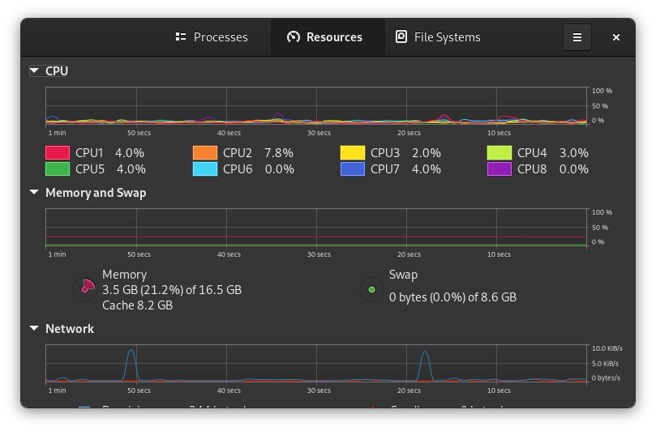

# Page-Bar

> Page-bar example screenshot from the GNOME System Monitor application.

A page-bar, tab-bar on iOS, or bottom navigation on Android is a widget that
lets you select different [pages](page.md) through a small number of fixed
horizontal tabs.  A page-bar should be limited to six pages maximum.  The pages
of a page bar may be the pages of the application, or pop-up pages that provide
additional buttons that did not fit in the [header-bar](headerbar.md), or what
would usually be found in a [tool-bar](toolbar.md) or [menu-bar](menubar.md).

Page-bars are most often located at the bottom of the window, although sometimes
at the top.  Top located page-bars should be avoided because of to the
[criticism on header-bars](headerbar.md#criticism).
