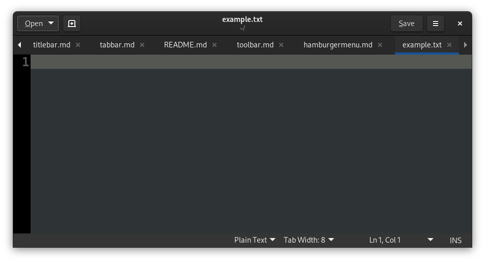

# ⚠ Status-Bar
**Archaic**: Use [hud](hud.md), [header-bar](headerbar.md), a separate
[page](page.md) or [infopane](infopane.md) instead for modern GUIs.

> Status-Bar example screenshot from the Libre Office application.

> Status-Bar example screenshot from the GEdit application.

Status bars are a widget at the bottom of a window that shows some status
information about the currently opened file.  They may also provide easily
configurable settings.

## Criticism
The status-bar waste's visual space, usually close to as much as a
[title-bar](titlebar.md).  This space could be saved by using [huds](hud.md).

The status-bar, similar to a [title-bar](titlebar.md), does not feel integrated
with the app, due to the fact that it's rendered as a separate pane.

The status-bar gets in the way of a bottom-oriented page-bar.  Without a
status-bar, a page-bar can be easily aimed at using the mouse using Fitt's Law
(1).

Settings that are usually only configured once don't need to be available in the
GUI at all times, as they are in GEdit.

# Links
 1. https://en.wikipedia.org/wiki/Fitts%27s_law
