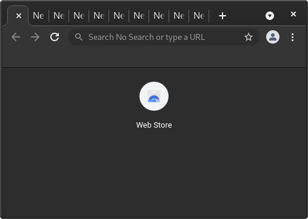

# ⚠ Tab-Bar
**Archaic**: Use [tab-tree](tabtree.md) instead for modern GUIs.

> Tab-bar example screenshot from the Chromium application.

A tab-bar is a horizontal list of tabs (not to be confused with iOS tab bar,
which is actually a [page-bar](pagebar.md)).  Tab-bars are often placed at the
top of the window inside the headerbar, but sometimes below.  They allow the
user to switch between tabs they have opened, as well as open and close tabs.

## Critique
Web browsers often squish the names of the tabs as you open more of them, making
the tabs undistinguishable from each other save for the favicon.  Scrolling tabs
often either do not exist or have a button you can hold to go left or right.
Tab-bars do not scale up to more than 10 tabs without losing functionality, and
are not feasible on smartphones.  Tab searching is also often unavailable in
most programs (except Chrome/Chromium).  The vertical scrolling of a
[tab-tree](tabtree.md) is much easier, and it's easy to add a search box.
