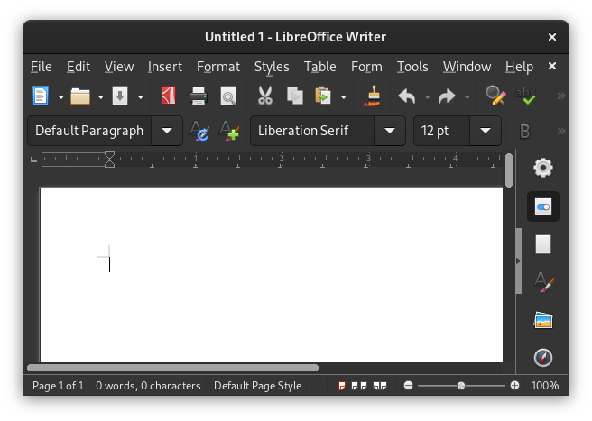

# ⚠ Tool-Bar
**Archaic**: Use [header-bar](headerbar.md), [page-bar](pagebar.md) and
[quick-menu](quickmenu.md), instead for modern GUIs.

> Tool-bars example screenshot from the Libre Office application.

Tool-bars are horizontal or vertical rows of buttons that are often customizable
and movable.

## Criticism
Tool-bars take up a lot of visual space, leaving less room for the actual
application.

Tool-bars also create visual distractions making it difficult for some users to
focus.

Having all buttons shown at all times can make it harder to find what you are
looking for.

Infinitely customizable tool-bars can cause the user to waste time trying to
make the perfect, most optimal tool-bar, if the provided ones are not
satisfactory.
